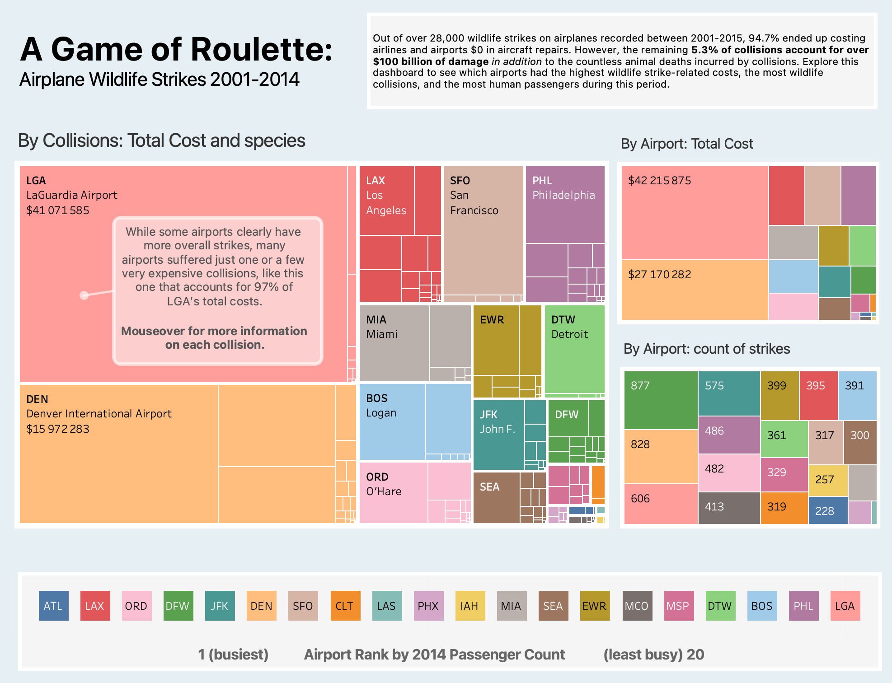

# Airplane Wildlife Strikes: Data Visualization by Tableau
***

### Author: Alexander K.

## Overview

## Project Goals
The main goal of this project is to practice and strengthen data visualization skills by working with Tableau Public. Through building interactive dashboards and visual analyses, the project aims to reinforce understanding of data connections, design principles, and storytelling techniques within Tableau.

Some questions that are posed:

- 

## Actions

- made basic data visualizations, paying attention to narrative and argument in the data
- adjusted aesthetic properties to further a visual argument
- added labels and tooltips for clarity and interactivity
- presented visualizations as a cohesive, balanced dashboard

## Data

There are two [datasets](https://www.dropbox.com/scl/fi/imowi7wd1501x56xat3u2/datasets_Airplane_Wildlife_Strikes_Tableau_Project.zip?rlkey=gb2y5siwi3d6vfpntjq0oqbok&dl=0) used in this project:

1. `FAA-wildlife-strikes.csv` - FAA Wildlife Strikes dataset
2. `passenger-counts_2014.csv` - 2014 Passenger Counts dataset

## Results

The final visualizations and dashboards can be found on my [Tableau Public profile](https://public.tableau.com/views/Airplane_Wildlife_Strikes_Tableau_Project/Dashboard1?:language=en-US&:sid=&:redirect=auth&:display_count=n&:origin=viz_share_link).